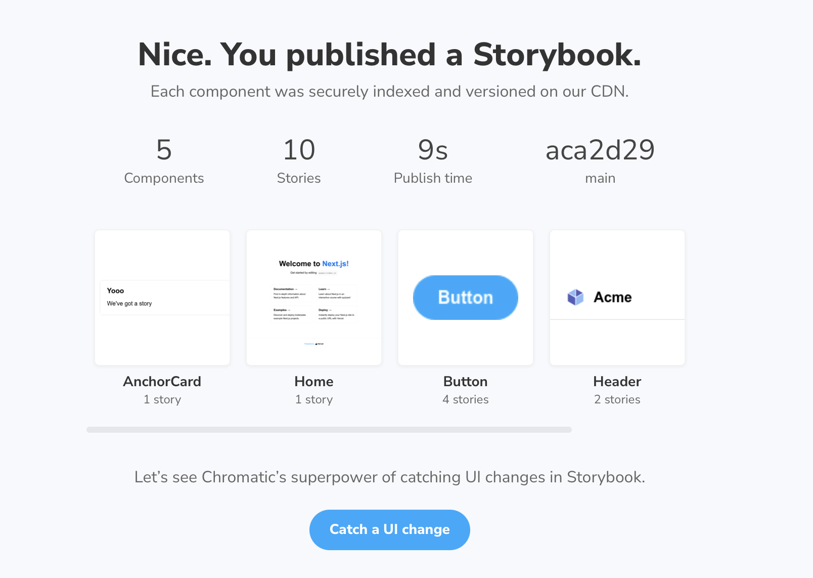
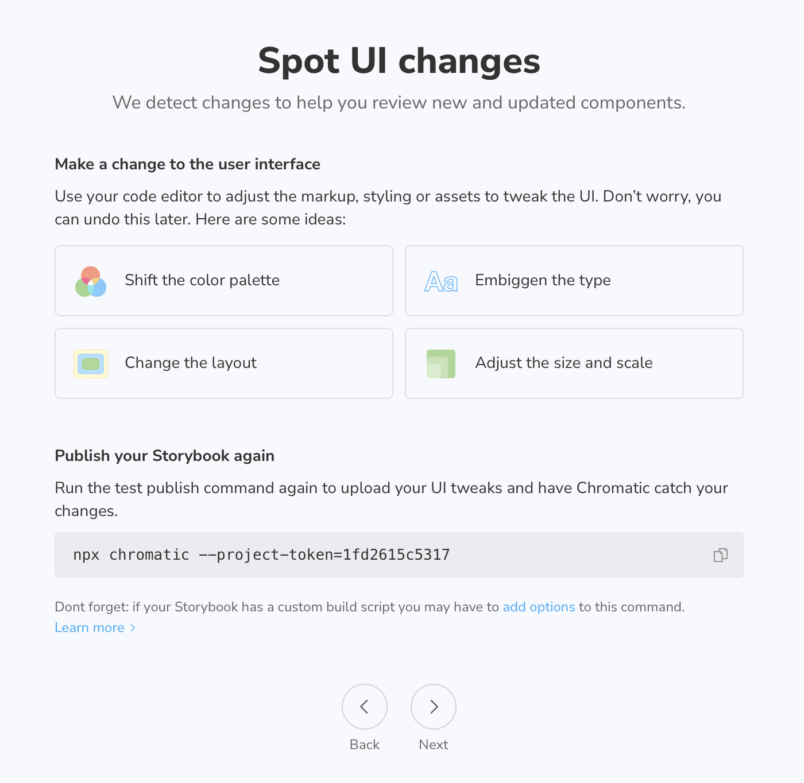

# storybook-nextjs

A setup run-thru of [Storybook](https://storybook.js.org) in a stock [Next.js](https://nextjs.org) app

## Steps

### Next.js

[Instructions](https://nextjs.org/docs)

- run `npx create-next-app --ts --use-npm`
  - npm because i prefer it to yarn
  - typescript because i thought it might add a level of configuration complication
  - **This will create a new project directory. There isn't an `in-place` option.**
- `cd storybook-nextjs`
- `npm run dev`
- `visit http://localhost:3000`

### Storybook

[Instructions](https://storybook.js.org/docs/react/get-started/install)

- run `npx sb init` _in_ project root
  - this makes sense whene there is an existing project (like this). it's not perfectly clear if I were using Storybook to build out a new, single component on design system
  - <mark>are there starters for projects like individual components and design systems for folks who want to use Storybook as their primary artifact?</mark>

> audited 1830 packages in 8.289s
> 236 packages are looking for funding
> run `npm fund` for details

> found 40 vulnerabilities (30 moderate, 10 high)
> run `npm audit fix` to fix them, or `npm audit` for details

- this feels like:
  - a LOT of dependencies
  - a lot of introduced vulnerabilities
- run `npm audit fix`
  - does not resolve vulnerabilities

> fixed 0 of 40 vulnerabilities in 1830 scanned packages
> 40 vulnerabilities required manual review and could not be updated

- `npm run storybook`
  - ✅ works!
- documentation jumps directly into ["What's a story?"](https://storybook.js.org/docs/react/get-started/whats-a-story)
  - because we used a generator, there are LOTS of new files. i think a document on the structure is warrented. even if just a link to another doc
  - items to cover
    - `.storybook`
      - `main.js`
      - `preview.js`
    - `stories`
      - `...stories`
      - `assets`
      - `introduction.mdx`
  - interesting time to cover the difference between stories and markdown
  - Component Story Format (CSF) should be a link to [docs/{library}/api/csf](https://storybook.js.org/docs/react/api/csf)
  - `alt` tags for images are sparce
    - consider "Screenshot of Storybook in browser. The sidebar has Story Button/Primary selected. The main are of the site shows the "Canvas" tab with the rendered button"
  - slight divergance in documentation demo and generated code

_documentation_

```tsx
// Button.stories.ts | Button.stories.tsx

import React from "react";

import { Story, Meta } from "@storybook/react";

import { Button } from "./Button";

export default {
  component: Button,
  title: "Components/Button",
} as Meta;

//👇 We create a “template” of how args map to rendering
const Template: Story<ButtonProps> = (args) => <Button {...args} />;

export const Primary = Template.bind({});

Primary.args = {
  primary: true,
  label: "Button",
};
```

_SB generated_

```tsx
import React from "react";
import { ComponentStory, ComponentMeta } from "@storybook/react";

import { Button } from "./Button";

export default {
  title: "Example/Button",
  component: Button,
  argTypes: {
    backgroundColor: { control: "color" },
  },
} as ComponentMeta<typeof Button>;

const Template: ComponentStory<typeof Button> = (args) => <Button {...args} />;

export const Primary = Template.bind({});
Primary.args = {
  primary: true,
  label: "Button",
};
```

- Setup a story outside of `/stories`
  - update config to include path
  - add story
  - restart server (not sure if this is always the case for config)
  - [include global css](https://storybook.js.org/docs/react/configure/overview#configure-story-rendering), link conveniently supplied
    - but there are no examples. kinda goes in a link loop
- Why don't I see type errors for `href` when attempting to use the component in a `.tsx` story?
- import `styles/globals.css` to `.storybook/preview.js`
- import `styles/Home.module.css` into `index.stories.tsx`
- no info here on CSS Modules
  - searched and got a lot of "Storybook CSS Modules don't work" hits
    - https://github.com/storybookjs/storybook/issues/12464
    - nothing on the [Styling and CSS](https://storybook.js.org/docs/react/configure/styling-and-css) page
    - [storybook-css-moudles-preset](https://www.npmjs.com/package/storybook-css-modules-preset) is the first promising result
      - `npm install -D storybook-css-modules-preset`
      - `40 fvulnerabilities (30 moderate, 10 high)`
      - append `storybook-css-modules-preset` to `addons` in `./storybook/main.js`
      - works
      - if this is the preferred way, we should document it. if not, we should create a new package
  - static next assets aren't available
    - https://www.google.com/search?q=storybook+assets+next.js&client=safari&rls=en&sxsrf=AOaemvIo6KjwrayvVGhUoG2-A9_PTB4JcA%3A1632184464335&ei=kChJYfTgE6y_0PEP_Muh6Ao&oq=storybook+assets+next.js&gs_lcp=Cgdnd3Mtd2l6EAMyBQgAEM0CMgUIABDNAjoHCAAQRxCwAzoICAAQ5AIQsAM6BQgAEIAEOgYIABAWEB46BQghEKABOgcIIRAKEKABSgUIPBIBMUoECEEYAFDHXVi3Z2DAamgBcAJ4AIAB4AGIAfcKkgEFMC42LjKYAQCgAQHIAQvAAQE&sclient=gws-wiz&ved=0ahUKEwj06ND56I7zAhWsHzQIHfxlCK0Q4dUDCA0&uact=5
    - https://stackoverflow.com/questions/64016896/cant-serve-static-files-in-nextjs-storybook
    - https://storybook.js.org/docs/react/configure/images-and-assets#serving-static-files-via-storybook
    - https://dev.to/jonasmerlin/how-to-use-the-next-js-image-component-in-storybook-1415
    - https://github.com/vercel/next.js/issues/18393
      - https://github.com/vercel/next.js/issues/18393#issuecomment-722024125
      - https://github.com/vercel/next.js/issues/18393#issuecomment-749631898
  - deferring to next commit
- At this point, I'm really curious if there could be some type of generator that would include story setup (which i end up copy-pasting)
- can we automatically create storybooks for anything in the /pages directory?

### Chromatic

- Login into Chromatic (create account)
- Choose Github option for selecting a project
- click on project
- see instructions
  - `npm install --save-dev chromatic`
  - `npx chromatic --project-token=1fd2615c5317`
    - questions:
      - is the token refreshable?
      - what happens if i accidentaly make my token public?
      - are there instructions for hiding the token?
      - how do i get back to this link again if i need it later?
        - [add options](https://www.chromatic.com/docs/cli)
        - [learn more](https://www.chromatic.com/docs/setup)
        - is there a way to have a "signed-in" version of these docs with the token (like Stripe)?
        - automation instructions?
        - talk about how this is the "baseline"?
        - reads more like it's just about publishing/hosting

```bash
Chromatic CLI v0.1.0
undefined

  ✔ Authenticated with Chromatic
    → Using project token '********5317'
  ✔ Retrieved git information
    → Commit '9d9c3d0' on branch 'main'; no parent commits found
  ✖ Collecting Storybook metadata
    → Most likely, you forgot to run npm install or yarn before running Chromatic.
    Build Storybook
    Publish your built Storybook
    Verify your Storybook
    Test your stories

Invalid dist-tag 'latest' returned from registry; skipping update check

Unhandled promise rejection: Cannot read property 'email' of undefined
TypeError: Cannot read property 'email' of undefined
    at /Users/chantastic/.npm/_npx/15962/lib/node_modules/chromatic/bin/218.main.cjs:251:291
    at Ge (/Users/chantastic/.npm/_npx/15962/lib/node_modules/chromatic/bin/218.main.cjs:256:99)
    at processTicksAndRejections (internal/process/task_queues.js:95:5)
    at async Promise.all (index 0)
    at async Ze (/Users/chantastic/.npm/_npx/15962/lib/node_modules/chromatic/bin/218.main.cjs:155:214)
    at async Module.Ve (/Users/chantastic/.npm/_npx/15962/lib/node_modules/chromatic/bin/218.main.cjs:155:101)
```

- this was totally a failure on my end. not sure if the install failed, if i typed it wrong, or what. but chromatic didn't get installed and *this* was the problem

```
Chromatic CLI v0.1.0
undefined

  ✔ Authenticated with Chromatic
    → Using project token '********5317'
  ✔ Retrieved git information
    → Commit 'aca2d29' on branch 'main'; no parent commits found
  ✔ Collected Storybook metadata
    → Storybook v6.3.8 for React; supported addons found: Actions, Essentials, Links
  ✔ Storybook built in 47 seconds
    → View build log at /Users/chantastic/Documents/GitHub/storybook-nextjs/build-storybook.log
  ✔ Publish complete in 8 seconds
    → View your Storybook at https://614a32227eef4b003adb8599-pbgtyyibez.chromatic.com
  ✔ Started build 1
    → Continue setup at https://www.chromatic.com/setup?appId=614a32227eef4b003adb8599
  ✔ Build 1 auto-accepted
    → Tested 10 stories across 5 components; captured 10 snapshots in 10 seconds

Invalid dist-tag 'latest' returned from registry; skipping update check

ℹ Speed up Continuous Integration
Your project is linked to GitHub so Chromatic will report results there.
This means you can pass the --exit-once-uploaded flag to skip waiting for build results.
Read more here: https://www.chromatic.com/docs/cli#chromatic-options

✔ Build passed. Welcome to Chromatic!
We found 5 components with 10 stories and took 10 snapshots.
ℹ Please continue setup at https://www.chromatic.com/setup?appId=614a32227eef4b003adb8599

⚠ No 'chromatic' script found in your package.json
Would you like me to add it for you? [y/N]
```

- all the links are absolutely incredible here!
- i have felt concerned about how to answer the question an the end without more details (as mentioned above)
  - went with `y` because i wanted to re-acquaint with what it does

```
✔ Added script 'chromatic' to package.json
You can now run it here or in CI with 'npm run chromatic' or 'yarn chromatic'.

ℹ Your project token was added to the script via the --project-token flag.
If you're running Chromatic via continuous integration, we recommend setting
the CHROMATIC_PROJECT_TOKEN environment variable in your CI environment.
You can then remove the --project-token from your package.json script.
```




This line gets added when I publish without changes

```
No changes found in the Storybook you published. Make a UI tweak and publish again to continue the demo.
```

I'd really like a "Skip" option or "show me this later" option when I'm just trying to get set up. As it stands, I'm not allowed to proceed until I do this. But I don't have anything that I want to *change* at the moment.

I have personally aborted this screen on many occasions.

Here, I will add an arbitrary story just to get it to pass.

Might be worth mentioning, at this point, that I can push anything I want. Can I do it without commiting?

---

Just pushed a build without committing. I've never thought about doing that but totally makes sense. I'm using Chromatic to update the baseline.

## Notes

### Interactions as Chromatic light
- I'm still forming a boundary around what Storybook is without Chromatic. And what the value is for developers
- Interactions changes the value proposition quite a bit
  - can i test navigation?